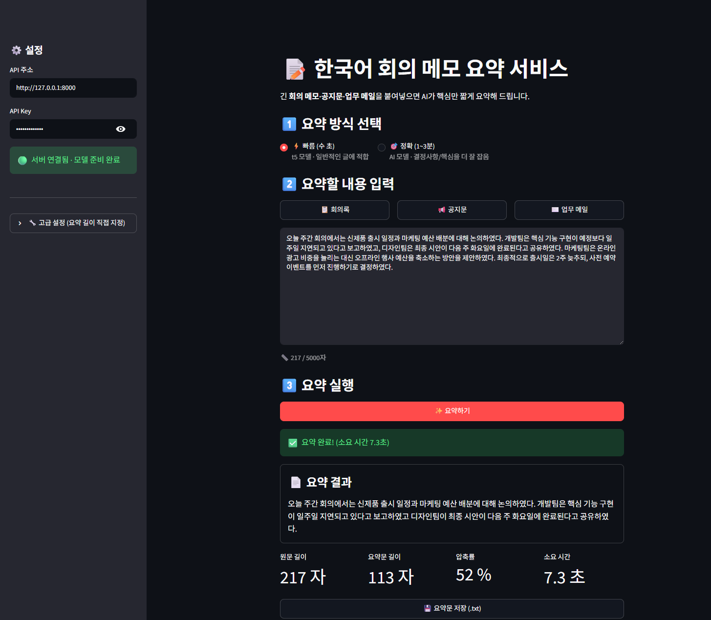

# Day 8 자율 프로젝트 — 한국어 회의 메모 요약 서비스

> 작성자: 신동범
> 과제: 모델 배포 개론 Day 8 — 나만의 모델 서빙 서비스 만들기
> 작업 환경: Windows 11 / VS Code / Python `.venv` 가상환경 (CPU, GPU 없음)

---

## 1. 프로젝트 개요

| 항목 | 내용 |
|---|---|
| **도메인 / 태스크** | 텍스트 요약 (`summarization`) |
| **서비스명** | 한국어 회의 메모 요약 서비스 |
| **설명** | 회의 메모·공지문·업무 메일 등 긴 한국어 글을 입력하면 핵심을 짧게 요약 |
| **구성** | FastAPI(백엔드) + Streamlit(프론트엔드) + Hugging Face 모델 |
| **요약 모드** | **빠름**(t5-base, 수 초) / **정확**(Qwen2.5-3B LLM, 1~3분) 2종 |
| **인증** | API Key (`X-API-Key` 헤더, 값: `my-secret-key`) |

---
## 2. 모델 시연 캡쳐


---

## 3. 모델 선택 & 개선 과정 (핵심 스토리)

이 프로젝트의 가장 중요한 부분은 "처음 모델이 잘 안 되어서 단계적으로 개선한 과정"이다.

| 단계 | 한 일 | 이유 / 결과 |
|---|---|---|
| 1 | `transformers<5`로 고정 | 최신 5.x에서 `summarization` 태스크가 `Unknown task` 오류 |
| 2 | `t5-base` → `t5-small` | base tokenizer 오류로 우선 small 사용 (이후 base 복귀) |
| 3 | `"summarize: "` 접두어 추가 | 이 T5 모델의 공식 사용법. 앞부분만 베끼던 문제 완화 |
| 4 | `num_beams=6`, `length_penalty=2.0` | 문장이 중간에 잘리지 않고 더 충실하게 |
| 5 | `t5-small` → `t5-base` | 품질 향상 (sentencepiece 설치로 tokenizer 문제 해결됨) |
| 6 | **입력 길이 기반 적응형 길이** | 짧은 글은 짧게, 긴 글은 길게 (환각 방지) |
| 7 | **빠름/정확 2모드 도입** | t5의 한계(아래)를 LLM으로 보완 |

### t5 요약 모델의 한계 (실험으로 확인)
t5 계열 요약 모델은 **신문기사로 학습**되어 "중요한 내용이 맨 앞"이라고 가정한다(lead bias). 그래서 **회의록처럼 결론이 맨 뒤에 오는 글에서는 핵심 결정을 놓친다.**

> **증거 실험:** 같은 결론 문장을 글 맨 뒤 → 맨 앞으로 위치만 옮겼더니, 맨 앞일 때만 요약에 포함되었다. 즉 모델이 *중요도*가 아니라 *위치*로 요약함을 확인했다.

이 한계 때문에 **지시형 LLM(Qwen2.5-3B)** 을 "정확 모드"로 추가했다. LLM은 "결정사항 중심으로 요약하라"는 지시를 이해해 위치와 무관하게 핵심을 잡는다.

---

## 4. 폴더 구조

```text
project_01/
├── app/
│   ├── __init__.py          # app 폴더를 파이썬 패키지로 인식
│   ├── auth.py              # API Key 인증
│   ├── schemas.py           # 입력/출력 검증 (Pydantic)
│   ├── model_service.py     # 모델 로드 + 요약 (빠름/정확 2모드)
│   └── main.py              # FastAPI 서버
├── frontend/
│   └── app.py               # Streamlit UI
├── requirements.txt
└── 모델배포개론08_프로젝트.ipynb
```

---

## 5. 구현 코드 (주석 포함)

### 4.1 `app/auth.py` — API Key 인증
요청 헤더의 `X-API-Key`를 검사해 키가 없거나 틀리면 **401**을 반환한다.

```python
from fastapi import HTTPException, Header

# 허용된 API Key { 키 : 사용자이름 }
VALID_API_KEYS = {
    "my-secret-key": "사용자A",
}


async def verify_api_key(x_api_key: str = Header(None)) -> str:
    if x_api_key is None:                       # 헤더를 아예 안 보냄
        raise HTTPException(status_code=401, detail="API Key가 필요합니다. X-API-Key 헤더를 포함해 주세요.")
    if x_api_key not in VALID_API_KEYS:         # 등록되지 않은 키
        raise HTTPException(status_code=401, detail="유효하지 않은 API Key입니다.")
    return VALID_API_KEYS[x_api_key]            # 올바른 키 → 사용자 이름 반환
```

### 4.2 `app/schemas.py` — 입력/출력 검증
규칙 위반 시 FastAPI가 자동으로 **422**를 반환한다.

```python
from typing import Literal, Optional
from pydantic import BaseModel, Field


class SummarizeRequest(BaseModel):
    text: str = Field(..., min_length=30, max_length=5000,   # 필수, 30~5000자
                      description="요약할 한국어 원문 (30~5000자)")
    # 요약 방식: fast(t5, 빠름) / accurate(LLM, 정확)
    mode: Literal["fast", "accurate"] = Field(default="fast")
    # 길이값을 안 보내면(None) 입력 길이에 맞춰 자동 계산 (빠름 모드)
    max_length: Optional[int] = Field(default=None, ge=30, le=200)
    min_length: Optional[int] = Field(default=None, ge=5, le=100)


class SummarizeResponse(BaseModel):
    success: bool             # 성공 여부
    summary: str              # 요약문
    original_length: int      # 원문 글자 수
    summary_length: int       # 요약문 글자 수
    model_name: str           # 사용한 모델
```

### 4.3 `app/model_service.py` — 모델 로드 + 요약 (2모드)
빠름(t5)은 서버 시작 시 로드, 정확(LLM)은 무거우므로 첫 요청 때 지연 로드한다.

```python
import torch
from transformers import pipeline, AutoModelForCausalLM, AutoTokenizer

T5_MODEL_NAME = "eenzeenee/t5-base-korean-summarization"   # 빠름
LLM_MODEL_NAME = "Qwen/Qwen2.5-3B-Instruct"                # 정확
PREFIX = "summarize: "        # t5 모델의 공식 접두어 (요약 품질↑)
_llm = None                   # 정확 모드 LLM 캐시 (지연 로드)


def load_model():
    """빠름(t5) 파이프라인 로드 (서버 시작 시 1회)."""
    return pipeline("summarization", model=T5_MODEL_NAME)


def _get_llm():
    """정확 모드 LLM 을 처음 한 번만 로드."""
    global _llm
    if _llm is None:
        torch.set_num_threads(10)
        tok = AutoTokenizer.from_pretrained(LLM_MODEL_NAME)
        model = AutoModelForCausalLM.from_pretrained(LLM_MODEL_NAME, torch_dtype=torch.bfloat16)
        model.eval()
        _llm = (tok, model)
    return _llm


def auto_lengths(model, text):
    """입력 토큰 수에 맞춰 요약 길이 자동 계산 (짧은 글은 짧게, 긴 글은 길게)."""
    n = len(model.tokenizer.encode(text))
    max_length = min(200, n + 10)                  # 넉넉히 (문장 잘림 방지)
    min_length = max(10, min(80, round(n * 0.3)))  # 입력의 약 30%
    return max_length, min_length


def _summarize_t5(model, text, max_length, min_length):
    if max_length is None or min_length is None:
        a_max, a_min = auto_lengths(model, text)
        max_length = a_max if max_length is None else max_length
        min_length = a_min if min_length is None else min_length
    min_length = min(min_length, max_length - 5)
    result = model(PREFIX + text, max_length=max_length, min_length=min_length,
                   do_sample=False, truncation=True, num_beams=6,
                   no_repeat_ngram_size=3, length_penalty=2.0)
    return result[0]["summary_text"]


def _summarize_llm(text):
    tok, model = _get_llm()
    messages = [
        {"role": "system", "content": "너는 한국어 글을 요약하는 비서다. 핵심 내용과 결정사항을 중심으로 간결하게 요약하라. 입력이 이미 짧으면 한 문장으로 핵심만 요약하라."},
        {"role": "user", "content": f"다음 글을 요약해줘:\n\n{text}"},
    ]
    prompt = tok.apply_chat_template(messages, tokenize=False, add_generation_prompt=True)
    inputs = tok(prompt, return_tensors="pt")
    with torch.no_grad():
        out = model.generate(**inputs, max_new_tokens=256, do_sample=False, num_beams=1)
    return tok.decode(out[0][inputs["input_ids"].shape[1]:], skip_special_tokens=True).strip()


def predict(model, text, mode="fast", max_length=None, min_length=None):
    """mode 에 따라 t5 또는 LLM 으로 요약하고 dict 반환."""
    if mode == "accurate":
        summary, model_name = _summarize_llm(text), LLM_MODEL_NAME
    else:
        summary, model_name = _summarize_t5(model, text, max_length, min_length), T5_MODEL_NAME
    return {
        "success": True, "summary": summary,
        "original_length": len(text), "summary_length": len(summary),
        "model_name": model_name,
    }
```

### 4.4 `app/main.py` — FastAPI 서버
`run_in_executor`로 무거운 추론을 별도 스레드에서 실행한다.

```python
import asyncio
from concurrent.futures import ThreadPoolExecutor
from fastapi import FastAPI, Depends, HTTPException
from fastapi.middleware.cors import CORSMiddleware

from app.auth import verify_api_key
from app.schemas import SummarizeRequest, SummarizeResponse
from app.model_service import load_model, predict, T5_MODEL_NAME, LLM_MODEL_NAME

app = FastAPI(title="한국어 회의 메모 요약 서비스", version="1.0.0")
app.add_middleware(CORSMiddleware, allow_origins=["*"], allow_methods=["*"], allow_headers=["*"])
inference_executor = ThreadPoolExecutor(max_workers=2)
summarizer = None


@app.on_event("startup")
async def startup():
    global summarizer
    summarizer = load_model()         # 빠름 모델만 시작 시 로드 (LLM은 지연 로드)


@app.get("/health")
async def health_check():
    return {"status": "ok" if summarizer else "loading", "model_loaded": summarizer is not None,
            "fast_model": T5_MODEL_NAME, "accurate_model": LLM_MODEL_NAME}


@app.post("/predict", response_model=SummarizeResponse)
async def summarize(request: SummarizeRequest, user: str = Depends(verify_api_key)):
    if summarizer is None:
        raise HTTPException(status_code=503, detail="모델이 아직 로드되지 않았습니다.")
    try:
        loop = asyncio.get_event_loop()
        result = await loop.run_in_executor(          # 비동기 추론 (서버 안 멈춤)
            inference_executor, predict,
            summarizer, request.text, request.mode, request.max_length, request.min_length)
    except Exception as e:
        raise HTTPException(status_code=500, detail=f"요약 처리 실패: {str(e)}")
    return SummarizeResponse(**result)
```

### 4.5 `frontend/app.py` — Streamlit UI (사용자 친화)
주요 기능: 예시 버튼 / 서버 연결 상태 표시 / 빠름·정확 모드 선택 / 글자수 카운터 / 결과 카드 + **소요 시간** + 압축률 / 요약문 다운로드. (전체 코드는 파일 참고)

```python
# 핵심 흐름만 발췌
import time, requests, streamlit as st

# 1) 모드 선택 (빠름/정확)
mode = "accurate" if mode_label.startswith("🎯") else "fast"

# 2) 요약 요청 + 소요 시간 측정
t0 = time.perf_counter()
resp = requests.post(f"{api_base}/predict",
                     json={"text": text, "mode": mode},
                     headers={"X-API-Key": api_key}, timeout=300)
elapsed = time.perf_counter() - t0

# 3) 결과 표시 (요약문 + 원문/요약/압축률/소요시간 지표)
if resp.status_code == 200:
    data = resp.json()
    st.success(f"✅ 요약 완료! (소요 시간 {elapsed:.1f}초)")
    st.write(data["summary"])
elif resp.status_code == 401:
    st.error("인증 실패: API Key 확인")
elif resp.status_code == 422:
    st.error("입력값 오류")
```

### 4.6 `requirements.txt`

```text
fastapi          # 백엔드 API 서버
uvicorn          # 서버 실행기
streamlit        # 프론트엔드 화면
requests         # 화면→서버 HTTP 요청
pydantic         # 입력/출력 검증
transformers<5   # Hugging Face 모델 (요약 task 위해 4.x 고정)
torch            # 딥러닝 엔진 (t5 + LLM 구동)
sentencepiece    # 한국어 토크나이저
nest_asyncio     # 노트북에서 서버 띄울 때
ipykernel        # 주피터 커널
```

---

## 5. 실행 방법

```bash
# 1) FastAPI 서버 (project_01 폴더 안에서)
uvicorn app.main:app --reload --host 127.0.0.1 --port 8000
#   또는 노트북에서: serve_in_thread("app.main:app", port=8000)

# 2) Streamlit 화면
streamlit run frontend/app.py
```
- Swagger UI: http://127.0.0.1:8000/docs
- Streamlit: http://localhost:8501

### Swagger에서 요약하기
1. `POST /predict` → `Try it out`
2. `x-api-key` 칸에 `my-secret-key` 입력
3. Request body 예시 입력 후 `Execute`
```json
{ "text": "오늘 회의에서는 ... (30자 이상)", "mode": "fast" }
```

---

## 6. 실행 결과 (실제 출력 + 의미)

### 6.1 `/health`
```json
{ "status": "ok", "model_loaded": true,
  "fast_model": "eenzeenee/t5-base-korean-summarization",
  "accurate_model": "Qwen/Qwen2.5-3B-Instruct" }
```
→ 서버 준비 완료, 빠름·정확 두 모델 모두 사용 가능.

### 6.2 인증/검증 동작
| 상황 | 상태코드 | 의미 |
|---|---|---|
| API Key 없음 | 401 | `"API Key가 필요합니다..."` |
| 잘못된 Key | 401 | `"유효하지 않은 API Key입니다."` |
| 30자 미만 입력 | 422 | `"String should have at least 30 characters"` |
| 정상 요청 | 200 | 요약 결과 반환 |

### 6.3 빠름 vs 정확 모드 비교 (321자 회의 메모)
입력: 고객만족도 회의록 (결론: "배송 업체 추가 계약=이달, 챗봇 도입=다음 분기")

| 모드 | 소요 | 요약 결과 |
|---|---|---|
| ⚡ 빠름(t5) | 8초 | 이번 분기 고객만족도 조사 결과 전체 만족도는 상승했으나 배송 지연과 고객센터 대기 시간에 대한 불만이 높은 것으로 나타났다. 이에 CS팀과 영업팀 개발팀이 모여 개선 방안을 논의했다. **(결정사항 누락)** |
| 🎯 정확(LLM) | 110초 | CS팀, 영업팀, 개발팀이 모여 배송 지연과 고객센터 대기 시간 문제를 해결하기로 했다. **배송 업체 추가 계약은 이달, 챗봇 도입은 다음 분기**에 각각 목표로 설정되었다. **(결정사항 정확)** |

→ **빠름은 글 앞쪽을, 정확은 결론(결정사항)을 잡는다.** 두 모드를 둔 이유를 가장 잘 보여주는 결과.

### 6.4 입력 길이에 따른 적응형 요약 (빠름 모드, 자동 길이)
| 입력 | 요약 | 동작 |
|---|---|---|
| 짧은글 57자 | 57자 | 줄일 게 없어 거의 그대로 (환각 없음) |
| 중간글 106자 | 106자 | 핵심 유지 |
| 긴글 217자 | 113자 | 약 52%로 압축 |

---

## 7. 성능 / 환경 참고 (정직한 한계)

- **하드웨어:** Intel Core 7 150U (저전력), RAM 31.7GB, **GPU 없음(CPU 추론)**
- **빠름(t5-base):** 요약 1건 약 1~8초, RAM ~1.5GB. 입력 약 1000자까지 처리(이후 잘림).
- **정확(Qwen2.5-3B):** 약 0.8 tok/s → 요약 1건 **약 40초~2분**. RAM ~6GB(bf16). 최초 1회 ~6GB 다운로드, 이후 로드 ~2초.
- 정확 모드는 품질이 좋지만 느리므로, **실시간 발표는 빠름 모드로 시연**하고 정확 모드 결과는 미리 준비하는 것을 권장.

---

## 8. 테스트 체크리스트 결과

| # | 항목 | 결과 |
|---|---|---|
| 1 | 모델 단독 테스트 | ✅ |
| 2 | FastAPI 서버 실행 | ✅ |
| 3 | `/health` 200 | ✅ |
| 4 | API Key 없이 401 | ✅ |
| 5 | 잘못된 Key 401 | ✅ |
| 6 | 30자 미만 422 | ✅ |
| 7 | 빠름 모드 200 | ✅ |
| 8 | 정확 모드 200 | ✅ |
| 9 | Streamlit 입력→결과 | ✅ |

---

## 9. 제출용 캡처 가이드

1. VS Code 프로젝트 폴더 구조
2. 모델 단독 테스트 성공 (노트북)
3. FastAPI 서버 실행 화면
4. Swagger `/health` 성공
5. Swagger `/predict` 성공 (`x-api-key`=`my-secret-key`)
6. API Key 없이 401
7. 30자 미만 422
8. Streamlit UI 화면
9. Streamlit 요약 결과 (빠름)
10. Streamlit 요약 결과 (정확) — 결정사항 포함 + 소요 시간 표시

---

## 10. 섹션 체크포인트 답변 (노트북 Q1~Q5)

**Q1. Pydantic 검증이 막는 잘못된 입력은?**
`text` 30자 미만/5000자 초과/누락, `max_length`(30~200)·`min_length`(5~100) 범위 밖, `mode`가 fast/accurate가 아닌 값. → 모델에 닿기 전 422로 차단.

**Q2. `Depends(verify_api_key)`를 제거하면?**
누구나 `/predict`를 호출할 수 있어, 특히 무거운 정확 모드(LLM)를 무제한 호출당하면 CPU/메모리 자원이 고갈된다.

**Q3. `run_in_executor`를 쓴 이유는?**
요약(특히 LLM)은 CPU를 오래 점유하는 동기 작업이다. 메인 이벤트 루프에서 돌리면 그동안 다른 요청이 모두 멈춘다. 별도 스레드에서 실행해 서버가 계속 응답하게 했다.

**Q4. 가장 많이 참고한 Day는?**
Day 6(인증 `auth.py`), Day 5/7(FastAPI 구조·`run_in_executor`). 챗봇 API 구조를 요약 태스크로 변형했다.

**Q5. 실제 배포에 더 필요한 것은?**
GPU 서버(LLM 속도), Docker 패키징, 클라우드 배포, API Key의 환경변수/DB 관리, 요청량 제한, 로깅·모니터링, HTTPS.

---

## 11. 프로젝트 회고

- **가장 큰 배움:** "모델이 결과를 내놓는다 ≠ 좋은 결과다." t5 요약 모델이 회의록 결론을 놓치는 현상을 보고, *왜* 그런지(신문 학습으로 인한 lead bias) 실험(문장 위치 바꾸기)으로 직접 확인한 과정이 가장 인상 깊었다.
- **트레이드오프 경험:** 품질을 높이려 LLM을 도입했지만 CPU에서 매우 느려, 결국 "빠름/정확"을 사용자가 고르는 2모드 구조로 풀었다. 정답이 하나가 아니라 상황에 맞는 균형이 중요함을 배웠다.
- **막혔던 지점:** transformers 버전(`<5`), tokenizer 오류(`sentencepiece`), 긴 입력 잘림(`truncation`), 짧은 입력 환각(적응형 길이), LLM 메모리(bf16) 등 — 대부분 "에러 메시지를 정확히 읽고 원인을 좁혀가며" 해결했다.
- **다음에 한다면:** GPU 환경에서 정확 모드를 기본으로 쓰고, 회의록 전용으로 더 다듬은 프롬프트/모델을 적용해보고 싶다.
```
